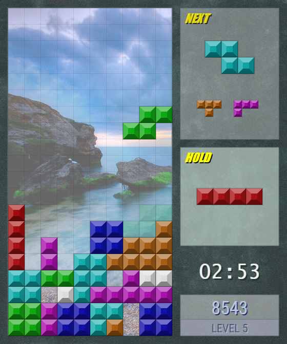

     _ _ _     _ _ _     _ _ _     _     _ _ _
    |_|_|_|   |_|_|_|   |_|_|_|   |_|   |_|_|_|
      |_|     |_|_ _      |_|      _      |_|
      |_|     |_|_|_|     |_|     |_|     |_|
     _|_|_     _ _|_|     |_|     |_|     |_|
    |_|_|_|   |_|_|_|     |_|     |_|     |_|

---

## I Swear This isn't Tetr\*s

The classic brick puzzle game in single player and multiplayer form. Originally developed many years ago, but updated recently to remove dependencies and modernize certain aspects of the coding style.

written by Aaron Wright <aaron@sikosoft.com>

https://www.sikosoft.com

---

## Technical Background

Written purely in Javascript, the game's visuals and rendering utilize the 2D context of the HTML5 Canvas API. An additional NodeJS backend server is provided to serve the static assets, while an additional WebSocket server provides the ability for multiple players to compete in real time with one another. As a player clears lines from their screen, lines are then sent to the opposing player.

The input handling class of the game also has built in native support for Xbox 360 controller mapping. Since the controller support provides an alternative input source than the keyboard, local multiplayer support is also possible.

---

## Live Demo

To play the game without setting anything up yourself, feel free to use the version on my site here:

https://sikosoft.com/istit/

---

## Game Controller Support

When the browser window has focus, press the "START" button on a connected Xbox 360 controller to enable play it.

---

## Leaderboard Support

Two endpoints can be configured to maintain a leaderboard of top scores. See _lbAdd_ and _lbGet_ in the configuration file.

The endpoint configured for adding a score to the leaderboard (_lbAdd_) should expect to receive a POST body containing:

- name
- score
- duration

The body will be posted as JSON.

Currently, no client-side cheat protection exists, but I am investigating approaches to prevent or discredit spoofed scores.

---

## Run Locally

npm run start

Or you can just copy all the static files somewhere and run them in the browser without the server. In this case, you should also copy the config.json file from the root folder and place it alongside the index.html. If running the server via npm, you don't need to copy the config.json file as it will be served automatically.

---

## Secure Server Configuration

If the _server.secure_ property is true, the server will attempt to operate in TLS (https) mode. When set to true, the additional configuration settings _server.secureKey_ and _server.secureCert_ much also be set. The values for these two properties represent the location of the necessary private key and public certificate used for encrypting communication from the domain acting as the server.

It's important to note that when running a secure WebSocket server that you should also change the prefix in the _mpServer_ setting from "ws://" to "wss://".
